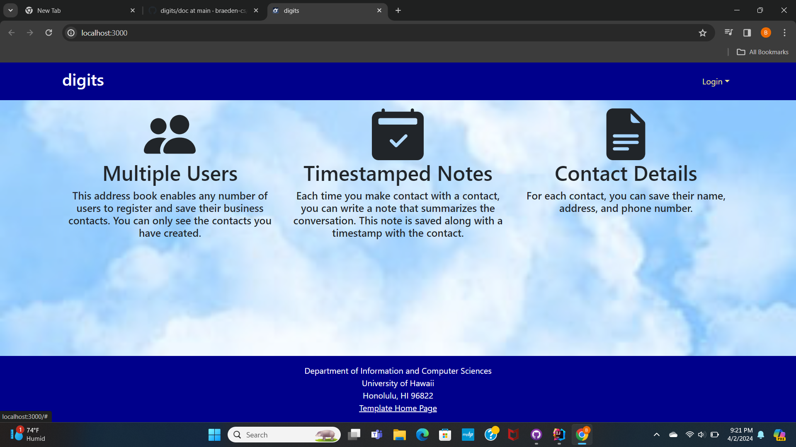
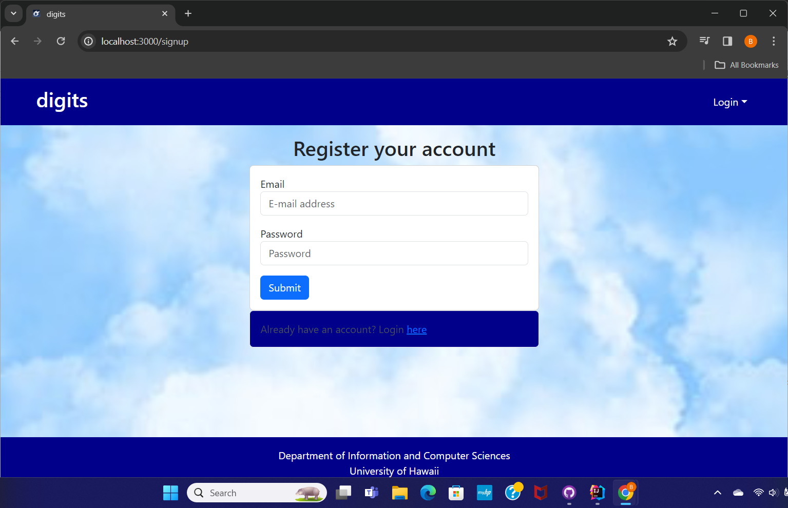
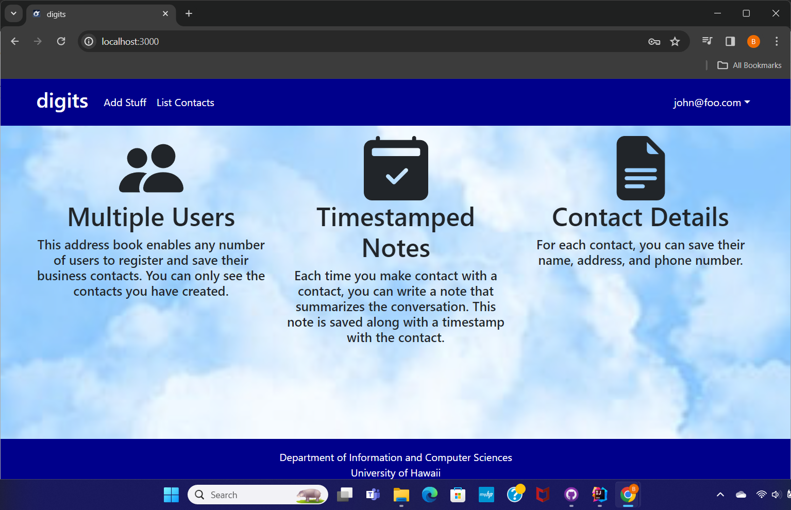
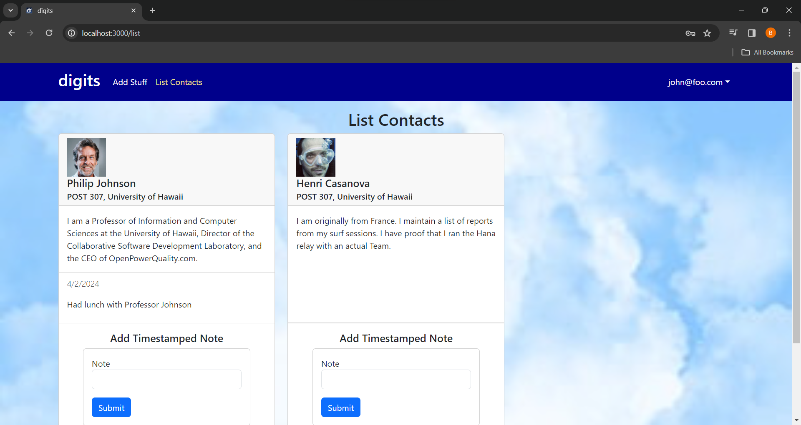
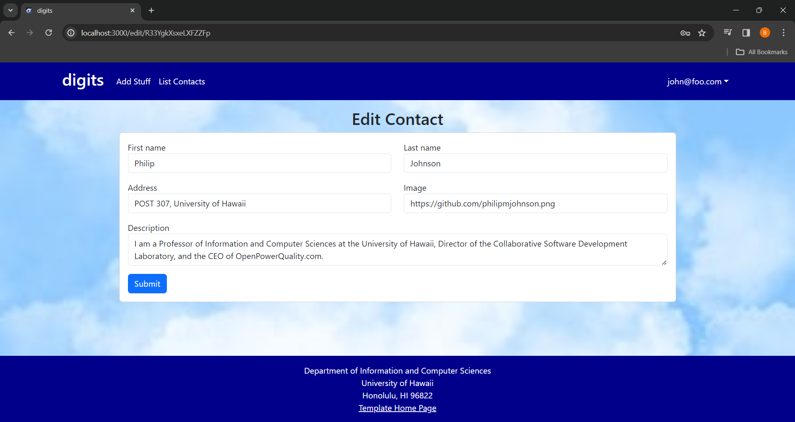

Digits is an web application that allows users to:

<ol>
 <li>Register an account</li>
 <li>Create and manage a set of contacts</li>
 <li>Add a set of tiemstamped notes regarding their interactions with each contact</li>
</ol>

<h1>Installation</h1>
First, isntall Meteor 

Second, download a copy of Digits. Note that Digits is a private repo and so you will need to request permission from the author to gain access to the repo.

Third, cd into the app directory install the required libraries with:

```
$ meteor npm install
```

Once the libraries are installed, you can run the application by invoking:

```
$ meteor npm run start
```

The first time you run the app, it will create some default users and ata. Here is the output:

```
I20240402-21:54:06.422(-10)? Creating the default user(s)
I20240402-21:54:06.552(-10)?   Creating user admin@foo.com.
I20240402-21:54:06.601(-10)?   Creating user john@foo.com.
I20240402-21:54:06.685(-10)? Creating default data.
I20240402-21:54:06.686(-10)?  Adding: Johnson (john@foo.com)
I20240402-21:54:06.734(-10)?  Adding: Casanova (john@foo.com)
I20240402-21:54:06.735(-10)?  Adding: Binsted (admin@foo.com)
=> Started your app.

=> App running at: http://localhost:3000/
```

The template application will appear at http://localhost:3000/. You can login using the credentials in settings.development.json, or else register a new account.

Lastly, you can run ESLint over the code in the imports/directory with:

```
meteor npm run lint
```

<h1>User Interface Walkthrough</h1>

<h2>Landing Page</h2>

When you first bring up the application, you will see the landing page that provides a brief introduction to the capabilities of Digits:


<h2>Register</h2>

If you do not yet have an account on the system, you can register by clickingon "Login", then "Sign Up":



<h2>Sign in</h2>

Click on the Login link, then click on the Sign in link to bring up the Sign in page which allows you to login:


<h2>User home page</h2>

After successfully logging in, the system takes you to your home page. It is just like the landing page, but the NavBar contains links to list contact and add new contacts:



<h2>List Contacts</h2>

Clicking on the List Contacts link brings up a page that lists all of the contacts associated with the logged in user:


This page also allows the user to add timestamped "notes" detailing interactions they've had with the Contact. For example:



<h2>Edit Contacts</h2>

From the List Contacts page, the user can click the "Edit" link associated with any Contact to bring up a page that allows that Contact information to be edited:



<h2>Admin mode</h2>

It is possible to designate one or more users as "Admins" through the settings file. When a user has the Admin role, they get access to a special NavBar link that retrieves a page listing all Contacts associated with all users:


